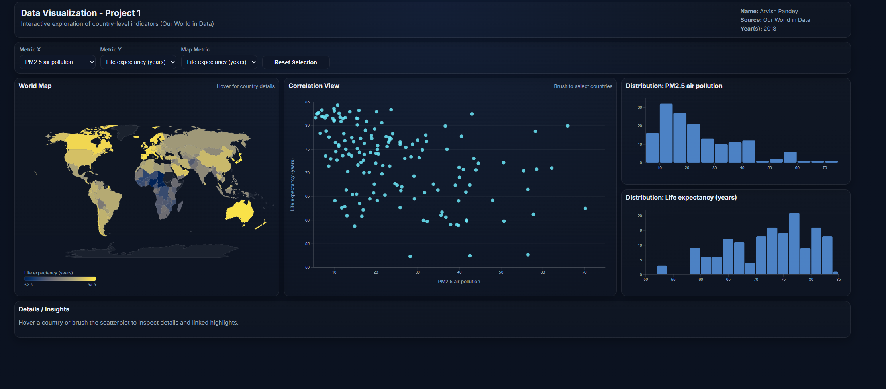

# Project 1 - Our World in Data

**Author:** Arvish Pandey  
**Course Project:** Data Visualization (D3.js / HTML / CSS / JavaScript)  
**Data Source:** [Our World in Data (OWID)](https://ourworldindata.org/)  
**Shared Analysis Year:** **2018** (common year across selected indicators after preprocessing)

**Live Link:** [Go Live!](https://worldindata.netlify.app/)

---

## ✨ Project Overview

This interactive dashboard helps a general audience explore how **life expectancy** varies across countries in relation to:

- 🌫️ **PM2.5 air pollution exposure** (environment)
- 🍽️ **Prevalence of undernourishment** (food/health condition)
- 💰 **GDP per capita** (economic context/control)

The goal is **not to prove causation**, but to support **exploratory reasoning** through coordinated visualizations and interactions.

---

## 🧠 Why this theme?

Rather than building a generic “country metrics” dashboard, this project is framed around a human-centered question:

> **How do food-related and environmental conditions relate to longevity across countries?**

This makes the dashboard more meaningful, interpretable, and engaging for a general audience.



The core motivation is a simple question I wanted answers to: how does longevity vary across countries, and how does it relate to environmental exposure, food insecurity, and economic context? This dashboard is meant for exploratory understanding. It does not claim that one variable causes another; instead, it helps a general audience observe patterns, identify outliers, and form sharper questions backed by what they can see across coordinated views.

---

## 📊 Dashboard Features (Implemented)

### Core Views
- 🗺️ **Choropleth world map** (selectable metric)
- 📈 **Scatterplot** for correlation exploration (X/Y selectable metrics)
- 📉 **Two histograms** for distribution analysis of selected X and Y metrics
- 🧾 **Details panel** for hovered/selected country information

### Interactions
- ✅ Hover tooltips on map, scatterplot, and histograms
- ✅ Linked highlighting across views
- ✅ Scatterplot brushing (select multiple countries)
- ✅ Reset selection control
- ✅ Metric selectors for X-axis, Y-axis, and map metric

---

## 🧪 Data & Preprocessing Summary

### Selected OWID Indicators
- **Life expectancy**
- **PM2.5 air pollution exposure**
- **Prevalence of undernourishment**
- **GDP per capita (Maddison Project Database)**

All data comes from Our World in Data (OWID). OWID provides country-level indicators across time; each downloaded dataset includes many years per country, and also includes non-country aggregates (such as regions or income groups). The application uses a single merged dataset for a shared year to ensure the map, scatterplot, and distribution views are comparable.

The indicators used in this project are: life expectancy (outcome), exposure to particulate matter air pollution (PM2.5) (environment), prevalence of undernourishment (food/health condition), and GDP per capita (context/control). Each indicator was downloaded as a CSV from OWID and then combined into one country-level file. Please refer to the necessary directory to view data.

### Preprocessing Steps
- Downloaded indicator CSVs from OWID
- Filtered to **country-level rows only** (ISO3 codes)
- Removed aggregates/regions
- Selected a **shared common year (2018)** for comparability
- Inner-joined all selected metrics into a single merged CSV
- Final merged dataset: **~154 countries** (country rows with complete values)

---

### Sketching

This project allowed me to be more hands-on and experimentative. Since I wanted details to fit perfectly in a single non-scrollable screen and having no idea how the maps and charts would turn out, sketching was slightly unrequired step in this case.

---

## ✅ Project Requirements Coverage (Levels)

## ✅ Level 1 — Completed
- ✅ D3.js + JavaScript + HTML + CSS web application
- ✅ Project title, author name, and data source shown
- ✅ Two+ quantitative country-level metrics selected
- ✅ Year(s) used are shown
- ✅ Data preprocessing / merged CSV created
- ✅ Distribution visualizations (histograms)
- ✅ Correlation visualization (scatterplot)

## ✅ Level 2 — Completed
- ✅ Spatial distribution via choropleth world map
- ✅ Comparison-friendly dashboard layout (multiple views visible together)
- ✅ Intentional color use for quantitative encoding

## ✅ Level 3 — Completed
- ✅ Expanded beyond 2 attributes (4 total metrics)
- ✅ User-selectable metrics (X, Y, Map)
- ✅ Views update dynamically based on user selections
- ✅ Clear UI controls for interaction

## ✅ Level 4 — Completed
- ✅ Detail-on-demand for map (hover tooltips + details panel)
- ✅ Detail-on-demand for distributions (bin hover details)
- ✅ Detail-on-demand for correlation view (point hover details)

## 🟡 Level 5 — Partially Completed
- ✅ Scatterplot brushing with linked updates across views
- ✅ Highlight-based coordinated interaction (instead of full filtering)
- ❌ Histogram brushing (not yet implemented)

---

## 🎨 Creative / “Out-of-the-Box” Design Choices

This project emphasizes creativity through **dashboard composition and interaction design** rather than a novel chart type:

- 🧭 **Human-centered analytical framing** (food + environment + longevity)
- 🧩 **Coordinated multi-view dashboard** (map + scatter + distributions + details)
- 🎛️ **Independent metric controls** (X, Y, and map metric can be explored separately)
- 🌙 **Polished dark UI** designed for readability and comparison
- 🔍 **Exploratory workflow** via brushing + linked highlighting + tooltips

---

## 🛠️ Tech Stack

- **D3.js (v7)**
- **HTML**
- **CSS**
- **Vanilla JavaScript**
- **Python (pandas)** for preprocessing OWID data

---

[](https://www.youtube.com/watch?v=Cb2tTHCWzlw)

---

### Challenges & Future Implementation

A major challenge was aligning multiple OWID indicators that do not share identical coverage across time. Each dataset has its own completeness patterns, so selecting a shared year required balancing recency against overlap. I approached this by choosing a single year with strong intersection across all selected indicators, prioritizing comparability across views over maximum time coverage.

Another challenge was turning multiple charts into one coherent exploration environment. Coordinated interactions are deceptively complex: a selection made in one view needs to remain readable and meaningful in the others. I addressed this by using linked highlighting rather than fully filtering the dataset, so the viewer keeps global context while still seeing the selected subset clearly.

Layout and usability also mattered. The dashboard was tuned to remain legible and professional in a single-screen configuration on a modern laptop in Chrome, because linked interactions lose value if a viewer needs to scroll to see what changed.

Future work: The next upgrade I would implement is a time selector that makes the dashboard feel alive. A year slider would allow the viewer to drag through time and watch the map, scatterplot, and distributions update together. This would allow exploration of whether relationships strengthen, weaken, or shift over time and would support questions about trajectories rather than snapshots. Additional future improvements include adding an explicit time-series panel for selected countries and extending selection mechanics to include distribution-based brushing directly on the histograms.

---

### Usage of AI

I used AI as a coding companion for this project, having a more involved approach. In the beginning, I used it to bounce ideas and design choices and eliminating extra options that would otherwise either waste valuable time or create distractions. I went on to create some boilerplate CSS styling and bounce off design choices and decide any dependencies and frameworks. It was extremely helpful when weighing options/advantages/disadvantages. It also helped me in creating this documentation by creating a template and allowing me to simply fill in the content.  

---

## 🚀 How to Run Locally

1. Clone the repository
2. Start a local server (required for loading CSV/GeoJSON)
3. Open the app in your browser

```bash
python -m http.server 8000
